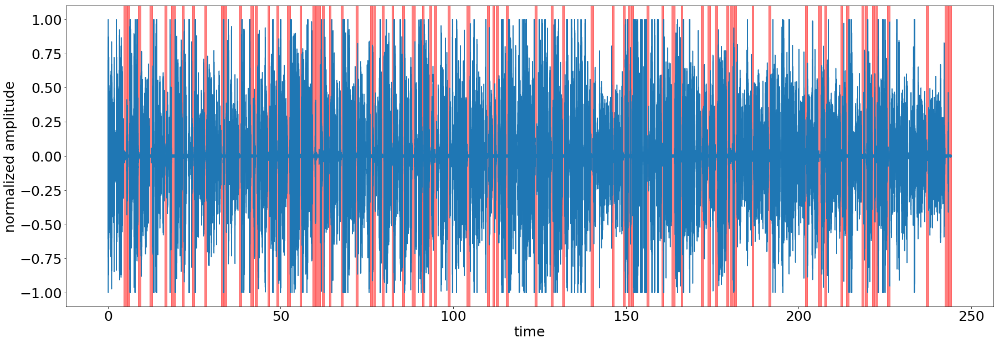

# silence-detection

Playing around with chunk audio and silence detection

In the plot below, the blue line is a an audio signal. The red regions are regions of silence. So this code is a naive version of a silence detector

## Points of caution 
- This analysis may not work on even slightly noisy videos. Manual threshold over so many videos may not make sense

## To do 
- Generate mel coefficients (MFCC) and do silence vs spoken speech analysis
- Filtering out noise
- Try spectral gating analysis for reducing noise
- Perhaps a bandpass filter for noise reduction 
- This is rather a slow operation in pydub. Have to find a way to speed it up and put it in a cookiecutter project

